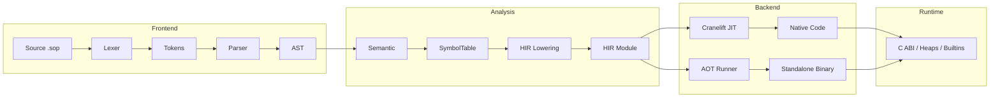

# Soplang Compiler — Architecture & Design

This document describes the full architecture of the Soplang compiler: pipeline, data structures, algorithms, and mechanisms. Soplang is a Somali-language scripting language implemented in Rust with a Cranelift JIT and an AOT backend.

---

## 1. High-Level Pipeline

**Mermaid diagram** (for GitHub/GitLab/docs viewers that support it):



**ASCII pipeline:**

```
┌─────────────┐     ┌─────────────┐     ┌─────────────┐     ┌─────────────┐     ┌─────────────┐
│   Source    │────▶│   Lexer     │────▶│   Parser    │────▶│  Semantic   │────▶│    HIR      │
│   (.sop)    │     │  (tokens)   │     │   (AST)     │     │  (symbols)  │     │  (flat IR)  │
└─────────────┘     └─────────────┘     └─────────────┘     └─────────────┘     └──────┬──────┘
                                                                                        │
        ┌───────────────────────────────────────────────────────────────────────────────┘
        │
        ▼
┌─────────────────────────────────────────────────────────────────────────────────────────────┐
│                              Backend (JIT or AOT)                                             │
│  ┌─────────────────────────────┐              ┌─────────────────────────────┐                │
│  │  Cranelift JIT               │              │  LLVM-style AOT             │                │
│  │  • Compile HIR → native code  │              │  • Generate Rust runner      │                │
│  │  • Register in runtime       │              │  • cargo build → binary     │                │
│  │  • Execute via function ptr  │              │  • Standalone executable    │                │
│  └──────────────┬──────────────┘              └──────────────┬──────────────┘                │
└─────────────────┼──────────────────────────────────────────┼───────────────────────────────┘
                   │                                          │
                   ▼                                          ▼
┌─────────────────────────────────────────────────────────────────────────────────────────────┐
│                           Runtime (C ABI, shared by both backends)                          │
│  • SoplangValue (tag + payload)  • Heaps (str, list, object)  • Globals  • Builtins (qor,…)  │
└─────────────────────────────────────────────────────────────────────────────────────────────┘
```

**Execution modes**

| Mode | Entry | Backend | Output |
|------|--------|---------|--------|
| **JIT** | `run_source()` | Cranelift | Run in-process |
| **AOT** | `build_source()` | Generated Rust crate → `cargo build` | Standalone binary |
| **REPL** | `Shell::run()` | Same as JIT per line | Interactive |

---

## 2. Data Structures Overview

| Stage | Primary structures | Purpose |
|-------|--------------------|--------|
| **Lexer** | `Token`, `TokenType` | One token: kind, lexeme, line, col |
| **Parser** | `Expr`, `Stmt`, `Literal`, `Param`, `TypeAnnotation` | Abstract syntax tree |
| **Semantic** | `SymbolTable`, `Scope`, `VarInfo`, `FunctionMeta`, `ClassMeta` | Names, slots, types |
| **HIR** | `HirModule`, `HirFunction`, `HirInstr`, `HirConst`, `BinOpKind`, `UnOpKind` | Flat IR with slots and labels |
| **Runtime** | `Value`, `SoplangValue`, heaps, globals | Values at execution time |
| **Error** | `SoplangError`, `ErrorMeta`, `codes::*` | Structured errors with location and hint |

---

## 3. Phase 1 — Lexer (Frontend)

**Location:** `src/frontend/lexer.rs`, `src/frontend/token.rs`

**Algorithm:** Single-pass, character-by-character scanner with one-character lookahead.

- **Whitespace:** Advance and skip (track line/col for newline).
- **Comments:** `//` line comment; `/* ... */` block comment (emit error if unclosed).
- **Identifiers/keywords:** `[a-zA-Z_][a-zA-Z0-9_]*`; match against keyword table (e.g. `door`, `hawl`, `haddii`).
- **Numbers:** Digit sequence, optional `.` and fractional part (single token, no semantic number validation here).
- **Strings:** `"` or `'` delimited; no escapes in the current spec.
- **Operators:** One- or two-character (e.g. `=`, `==`, `<=`, `&&`, `||`).

**Data structures**

- **`Token`:** `kind: TokenType`, `lexeme: String`, `line: usize`, `col: usize`.
- **`TokenType`:** Enum of keywords, literals (True/False/Null), Identifier, Number, String, operators, structural (`( ) { } [ ] , : ; .`), Eof.

**Mechanism:** `Lexer` holds a `Peekable<Chars>` and current line/col; `next_token()` returns one token; `tokenize()` collects until Eof. Errors are `SoplangError::Lexer` with code (e.g. E001, E002, E003).

---

## 4. Phase 2 — Parser (Frontend)

**Location:** `src/frontend/parser.rs`, `src/frontend/ast.rs`

**Algorithm:** Recursive descent, one token lookahead. Grammar is expression- and statement-oriented.

- **Top level:** `parse()` repeatedly calls `parse_stmt()` until Eof.
- **Statements:** Dispatched by first token (e.g. `haddii` → if, `door`/`madoor` → var decl, `hawl` → function, identifier → assignment or call). Nested blocks and control flow are recursive.
- **Expressions:** Precedence layers (from low to high): logical (`||`, `&&`) → comparison (`==`, `<`, …) → additive (`+`, `-`) → multiplicative (`*`, `/`, `%`) → unary → postfix (call, index, property). Each layer calls the next.

**Data structures (AST)**

- **`Expr`:** Literal, Identifier, BinaryOp, UnaryOp, Call, MethodCall, Index, Property, List, Object.
- **`Stmt`:** VarDecl, Assign, FuncDef, ClassDef, If, Switch, For, While, Return, Break, Continue, TryCatch, Import, Block, Expr.
- **`Literal`:** Int, Float, Str, Bool, Null.
- **`TypeAnnotation`:** Abn, Jajab, Qoraal, Bool, Teed, Walax, Dynamic (for `door`/`madoor`).
- **`Param`:** name + type annotation.

**Mechanism:** Parser holds `tokens: Vec<Token>`, `current: usize`. `peek()`, `advance()`, `check(kind)`, `expect(kind)` drive the parse. On mismatch, `parser_error(...)` yields `SoplangError::Parser`. Optional `parse_single_expression()` for REPL/`-c` (one expression, then Eof).

---

## 5. Phase 3 — Semantic Analysis

**Location:** `src/semantic/analyze.rs`, `src/semantic/scope.rs`

**Algorithm:** Single pass over the AST building a symbol table and checking types.

- **Scopes:** A stack of scopes; global is scope 0. Enter block/function/class pushes a scope; exit pops.
- **Name resolution:** For each use, resolve in current scope then outer scopes; record slot index and type.
- **Function/class metadata:** Collect signatures and method names; store in `SymbolTable.functions` and `SymbolTable.classes`.
- **Type checking:** In strict mode, reject Dynamic where a concrete type is required; check return types and parameter types; check redeclaration (E020) and use of undeclared names (E021).

**Data structures**

- **`SymbolTable`:** `scopes: Vec<Scope>`, `functions: Vec<FunctionMeta>`, `classes: HashMap<String, ClassMeta>`.
- **`Scope`:** `vars: HashMap<String, VarInfo>`.
- **`VarInfo`:** `slot`, `type_ann`, `is_const`, `is_captured`.
- **`FunctionMeta`:** name, param_slots, param_types, return_ann, local_count, captures, scope_vars.
- **`ClassMeta`:** name, parent, methods.

**Mechanism:** `analyze_with_options(stmts, AnalyzeOptions { strict })` returns `Result<SymbolTable, SoplangError>`. Helper `resolve_name(sym, name, func_scope)` returns `Option<VarInfo>` for HIR lowering. Errors are `SoplangError::Type` with codes (E020, E021, E022) and optional hints.

---

## 6. Phase 4 — HIR Lowering

**Location:** `src/hir/lower.rs`

**Algorithm:** Walk the AST with symbol table and emit a linear, backend-agnostic IR.

- **Slots:** Virtual “registers” (indices). Each local and temporary gets a slot; globals are named (load/store by name).
- **Labels:** Unique IDs for branches (loops, switch, try/catch). Forward jumps resolved when emitting.
- **Lowering rules:**  
  - Expression → sequence of instructions that leave result in a slot.  
  - Statement → side-effect instructions (store, call, control flow).  
  - Control flow → Label, Jump, JumpIf; loops and switch emit multiple blocks.  
  - Function → `HirFunction` with params, local_count, body; top-level → `HirModule.top_level`.

**Data structures (HIR)**

- **`HirModule`:** `functions: Vec<HirFunction>`, `top_level: Vec<HirInstr>`.
- **`HirFunction`:** name, params (slot list), local_count, body, is_static.
- **`HirInstr`:** Const, Copy, Load, Store, BinOp, UnOp, BuildList, BuildObject, GetIndex, SetIndex, GetProp, SetProp, Label, Jump, JumpIf, Call, CallMethod, Return, Break, Continue, TryBegin, TryEnd, BindError, Pop, CheckType, MarkConst.
- **`HirConst`:** Int, Float, Str, Bool, Null.
- **`BinOpKind` / `UnOpKind`:** Add, Sub, Mul, Div, Mod, Eq, Ne, Lt, Le, Gt, Ge, And, Or; Neg, Not.

**Mechanism:** `HirLowering::lower(sym, stmts)` returns `HirModule`. Uses `resolve_name` to map names to slots; const globals get MarkConst; method dispatch and builtins are left as Call/CallMethod for the backend to resolve.

---

## 7. Phase 5 — Backends

### 7.1 Cranelift JIT

**Location:** `src/backend/cranelift.rs`

**Algorithm:**

1. **Module setup:** Cranelift `Module` + JIT builder; declare and define functions.
2. **Value representation:** Each Soplang value is two machine words (tag, payload). Slots in HIR map to Cranelift variables (tag + payload pairs).
3. **Top-level:** One function `soplang_main`; body is compilation of `top_level`; slot variables allocated (e.g. stack slots); each HIR instruction lowered to Cranelift IR (loads, stores, arithmetic, calls).
4. **User functions:** One Cranelift function per `HirFunction`; params and locals as slot pairs; body compiled similarly; function pointer registered in runtime and stored in globals.
5. **Calls:** To builtin → call runtime’s native stub (e.g. `soplang_qor`); to user → load function value, call via `CompiledFnEntry` table.
6. **Execution:** `run_main()` finalizes the module, gets pointer to `soplang_main`, casts to `extern "C" fn()`, and calls it.

**Mechanism:** FunctionBuilder for SSA-style IR; stack slots for locals; symbol table for runtime C symbols (`soplang_*`). All heap access and builtin behavior go through the runtime ABI.

### 7.2 AOT (LLVM-style)

**Location:** `src/backend/llvm.rs`

**Algorithm:**

1. **No direct LLVM:** AOT is implemented by generating a **Rust crate** that embeds the source and depends on the `soplang` library.
2. **Generated crate:** Fixed dir `target/soplang_aot_runner/`; `Cargo.toml` with `soplang = { path = "..." }`; `src/main.rs` contains `const SOURCE: &str = ...` and `run_source(SOURCE, ...)`.
3. **Build:** `cargo build --quiet --manifest-path <that Cargo.toml> --release`; stdout/stderr captured; on failure, last 25 lines of stderr returned in a structured error.
4. **Output:** Copy the built binary from `target/release/soplang_aot_runner` to the user-requested path (e.g. `barnaamij/<name>`); create parent dirs if needed.

**Mechanism:** Same runtime and `run_source` as JIT; the “compilation” is done at build time of the generated crate; the resulting binary is a standalone runner that JIT-compiles the embedded source when executed.

---

## 8. Runtime

**Location:** `src/runtime/` (value, stdlib, abi)

### 8.1 Value Representation

**Internal (`Value`):** Rust enum — Int(i64), Float(f64), Str(String), Bool(bool), List(Rc<RefCell<Vec<Value>>>), Object(Rc<RefCell<HashMap<String, Value>>>), Function(FunctionId), NativeFunction(NativeFn), Null. Used by stdlib and when converting to/from ABI.

**C ABI (`SoplangValue`):** 16 bytes, `#[repr(C)]`: tag (u8), padding (7 bytes), payload (i64). Tag constants: TAG_NULL, TAG_INT, TAG_FLOAT, TAG_BOOL, TAG_STR, TAG_LIST, TAG_OBJECT, TAG_FUNC. Used at the boundary between generated code and runtime (both JIT and AOT runner).

**Mechanism:** Heaps (thread_local): STR_HEAP, LIST_HEAP, OBJ_HEAP; NATIVE_FN_TABLE, BUILTIN_INDICES, GLOBAL_VARS, COMPILED_FN_TABLE, CONST_GLOBALS. `value_to_soplang` / `soplang_to_value` convert; heap indices and function indices stored in payload.

### 8.2 Builtins (Stdlib)

**Location:** `src/runtime/stdlib.rs`

**Mechanism:** `get_builtin_functions()` returns a map of name → `Value::NativeFunction(f)`. Examples: `qor` (print), `gelin` (read line), `qoraal` (to string), list methods (kasaar, dherer, kudar, …), object methods (fure, qiime, …), string methods (qeybi, kudar, …). Backends call into runtime via C symbols (e.g. `soplang_qor`, `soplang_gelin`); runtime dispatches to these native functions.

### 8.3 C ABI Surface

**Location:** `src/runtime/abi.rs`

**Exports:** `soplang_qor`, `soplang_gelin`, `soplang_nooc`, `soplang_list_new`, `soplang_list_push`, … (all `pub extern "C"`). Plus `store_global`, `register_compiled_fn`, `value_to_soplang`, `soplang_to_value`. These are the only interface the generated code uses to interact with values and builtins.

---

## 9. Error Handling

**Location:** `src/error/` (mod.rs, format.rs)

**Data structures:** `SoplangError` variants (Lexer, Parser, Runtime, Type, Import), each with msg, line, col, and `ErrorMeta` (code, end_line, end_col, hint, file). `ErrorMeta` supports builder-style `.with_code()`, `.with_span()`, `.with_hint()`.

**Codes:** E001–E009 lexer, E010–E019 parser, E020–E029 type/semantic, E030–E039 runtime. Used in tests and for machine-readable diagnostics.

**Formatting:** `format_error_with_source(err, source)` produces a colored header, source line with caret underline, and optional dimmed hint. Respects `NO_COLOR`.

**Mechanism:** Constructors (`lexer_error`, `parser_error`, `runtime_error`, `type_error`, etc.) used from lexer, parser, semantic, and runtime; backend and CLI call `format_error_with_source` for user-facing output.

---

## 10. Module Map (Source Layout)

```
src/
├── main.rs              # CLI entry; build/run/REPL dispatch
├── lib.rs               # Public API; run_source, build_source, maybe_wrap_for_repl
├── frontend/            # Source → AST
│   ├── mod.rs
│   ├── token.rs         # Token, TokenType
│   ├── lexer.rs         # Lexer
│   ├── ast.rs           # Expr, Stmt, Literal, Param, TypeAnnotation
│   └── parser.rs        # Parser
├── semantic/            # AST → Symbol table
│   ├── mod.rs
│   ├── scope.rs         # Env (optional scoped env)
│   └── analyze.rs       # analyze, SymbolTable, Scope, VarInfo, FunctionMeta, ClassMeta
├── hir/                 # AST → HIR
│   ├── mod.rs
│   └── lower.rs         # HirLowering, HirModule, HirInstr, …
├── backend/             # HIR → native / binary
│   ├── mod.rs
│   ├── cranelift.rs     # JIT
│   └── llvm.rs          # AOT (generated Rust crate)
├── runtime/             # Values, builtins, C ABI
│   ├── mod.rs
│   ├── value.rs         # Value, value_to_string, NativeFn
│   ├── stdlib.rs        # Builtins
│   └── abi.rs           # SoplangValue, heaps, pub extern "C" fns
├── error/               # Errors and formatting
│   ├── mod.rs           # SoplangError, ErrorMeta, constructors, codes
│   └── format.rs        # format_error_with_source
└── cli/                 # REPL
    ├── mod.rs
    └── shell.rs         # Shell, history, /commands
```

**Dependency direction:** frontend → error; semantic → frontend, error; hir → frontend, semantic; backend → hir, runtime, error; runtime → error; cli → (lib API). No cycles.

---

## 11. Algorithm Summary

| Phase      | Algorithm              | Key idea |
|-----------|------------------------|----------|
| Lexer     | Single-pass scanner    | One token at a time; keywords via table; errors with location. |
| Parser    | Recursive descent      | One lookahead; precedence by recursive layers; AST is tree of Expr/Stmt. |
| Semantic  | Single-pass analysis   | Scope stack; name → VarInfo/slot; strict type checks; collect function/class metadata. |
| HIR       | AST walk + IR emit     | Slots for locals/temporaries; labels for control flow; flat instruction list. |
| Cranelift | HIR → SSA + codegen    | Slots → Cranelift vars; each HIR op → Cranelift IR; C ABI for calls. |
| AOT       | Source embedding       | Generate Rust crate that calls run_source; build with cargo; copy binary. |
| Runtime   | Tagged values + heaps | Value ↔ SoplangValue; heaps for strings/lists/objects; globals and compiled fn table. |

---

## 12. Design Decisions

- **Single IR (HIR):** One flat IR for both JIT and AOT; backends share the same lowering and runtime.
- **C ABI boundary:** Generated code (Cranelift or AOT binary) only talks to the runtime via `SoplangValue` and `extern "C"` functions; no direct dependency on `Value` or stdlib types in generated code.
- **Slot-based HIR:** No SSA in the IR; slots are virtual registers; Cranelift backend maps them to its own SSA variables and stack.
- **Thread-local heaps:** Simplifies embedding and avoids global locks; one “interpreter” per thread.
- **Somali messages and codes:** Errors and builtins use Somali where appropriate; error codes (E0xx) allow stable tooling and docs.

This architecture supports a clear pipeline, maintainable modules, and two execution modes (JIT and AOT) sharing one runtime and one language implementation.
